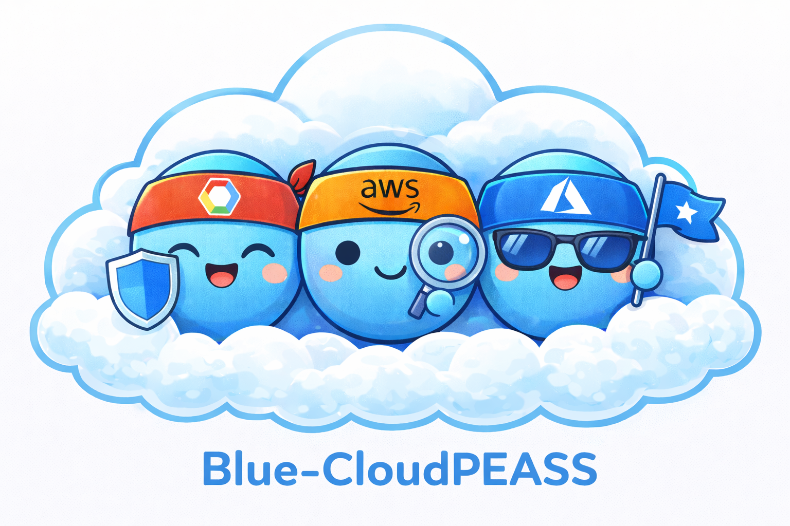

# Blue Cloud PEASS



Blue Cloud PEASS helps blue teams and auditors quickly find risky IAM privileges, unused access, and external trust relationships across AWS, GCP, and Azure.

## What this repo does

- Classifies permissions at runtime using rule files in `risk_rules/` (no huge “full catalog” YAMLs needed for execution).
- Produces a **human-readable console report** and an **optional JSON report** (`--out-json <path>`) with a consistent, normalized structure across clouds.
- JSON output includes **permission source attribution** (which role/policy grants each flagged permission) and **group membership expansion** when available.
- Normalized JSON is compacted with **permission/principal/role/group catalogs** so repeated data is referenced by ID.
- Focuses on:
  - **Flagged permissions** (default: `high,critical`)
  - **Inactive principals** (best-effort, provider-dependent)
  - **Unused custom roles/policies**
  - **Keys** (AWS access keys, GCP SA keys)
  - **External trusts** (public access, external identities, cross-account / federation)

## Install

```bash
python3 -m pip install -r requirements.txt
```

---

<details>
<summary><b>Blue-AWSPEAS.py (AWS)</b></summary>

### Goal
Audit one or more AWS accounts and highlight:
- Principals (users/groups/roles) with flagged permissions
- Unused principals / unused permissions (if Access Analyzer is used)
- Customer-managed IAM policies that are unused
- IAM user access keys (always listed)
- Roles trusting external accounts/providers (best-effort)
- Group memberships (user → group) for relationship graphing

### Techniques used
- IAM enumeration (users, groups, roles, inline + attached policies)
- Policy parsing to compute effective actions (optionally filter to `Resource: *`)
- Permission source attribution per principal (policy/role → flagged permission)
- AWS Access Analyzer (optional) to detect:
  - Unused roles/users/passwords/keys
  - Unused access (unused permissions findings)

### Required permissions (recommended)
For best results, use `ReadOnlyAccess` plus Access Analyzer read access.

**Baseline (minimum-ish):**
- STS identity: `sts:GetCallerIdentity`
- IAM enumeration + policy reads (granular):
  - Principals: `iam:ListUsers`, `iam:ListGroups`, `iam:ListRoles`, `iam:GetGroup`, `iam:ListGroupsForUser`
  - Attached managed policies: `iam:ListAttachedUserPolicies`, `iam:ListAttachedGroupPolicies`, `iam:ListAttachedRolePolicies`
  - Inline policies: `iam:ListUserPolicies`, `iam:ListGroupPolicies`, `iam:ListRolePolicies`, `iam:GetUserPolicy`, `iam:GetGroupPolicy`, `iam:GetRolePolicy`
  - Managed policy documents: `iam:GetPolicy`, `iam:GetPolicyVersion`
  - Customer-managed policy discovery: `iam:ListPolicies`, `iam:GetPolicy`, `iam:GetPolicyVersion`
  - User access keys (always reported): `iam:ListAccessKeys`, `iam:GetAccessKeyLastUsed`

### Minimum permissions & setup (AWS CLI)
Example of creating an IAM user with the minimal permissions to run Blue-AWSPEAS (includes Access Analyzer):

```bash
USER_NAME="blue-cloudpeass-auditor"

aws iam create-user --user-name "${USER_NAME}"

cat > /tmp/blue-aws-min.json <<'JSON'
{
  "Version": "2012-10-17",
  "Statement": [
    {
      "Sid": "BlueAwsPeassRead",
      "Effect": "Allow",
      "Action": [
        "sts:GetCallerIdentity",
        "iam:ListUsers",
        "iam:ListGroups",
        "iam:ListRoles",
        "iam:GetGroup",
        "iam:ListGroupsForUser",
        "iam:ListAttachedUserPolicies",
        "iam:ListAttachedGroupPolicies",
        "iam:ListAttachedRolePolicies",
        "iam:ListUserPolicies",
        "iam:ListGroupPolicies",
        "iam:ListRolePolicies",
        "iam:GetUserPolicy",
        "iam:GetGroupPolicy",
        "iam:GetRolePolicy",
        "iam:ListPolicies",
        "iam:GetPolicy",
        "iam:GetPolicyVersion",
        "iam:ListAccessKeys",
        "iam:GetAccessKeyLastUsed",
        "access-analyzer:List*",
        "access-analyzer:Get*",
        "access-analyzer:CreateAnalyzer",
        "access-analyzer:DeleteAnalyzer",
        "iam:CreateServiceLinkedRole"
      ],
      "Resource": "*"
    }
  ]
}
JSON

aws iam put-user-policy \
  --user-name "${USER_NAME}" \
  --policy-name "BlueAwsPeassMin" \
  --policy-document file:///tmp/blue-aws-min.json

# Create access key for the user
aws iam create-access-key --user-name "${USER_NAME}"
```

If you do not want Access Analyzer, remove the `access-analyzer:*` permissions and `iam:CreateServiceLinkedRole` from the policy.

**If you use `--assume-roles`:**
- `sts:AssumeRole` on the target role ARNs

**If using Access Analyzer (recommended):**
- If analyzers already exist: `AWSAccessAnalyzerReadOnlyAccess`
- If the tool must create/delete analyzers:
  - `access-analyzer:CreateAnalyzer`, `access-analyzer:DeleteAnalyzer`, `access-analyzer:List*`, `access-analyzer:Get*`
  - `iam:CreateServiceLinkedRole` (for `access-analyzer.amazonaws.com`)

### Help
```bash
python3 Blue-AWSPEAS.py --help
```

**Help output**
```text
usage: Blue-AWSPEAS.py [-h] [--profile PROFILE] [-v] [--no-access-analyzer]
                       [--only-all-resources] [--risk-levels RISK_LEVELS]
                       [--max-perms-to-print MAX_PERMS_TO_PRINT]
                       [--min-unused-days MIN_UNUSED_DAYS]
                       [--out-json OUT_JSON]
                       [--max-parallel-accounts MAX_PARALLEL_ACCOUNTS]
                       [--access-key-id ACCESS_KEY_ID]
                       [--secret-access-key SECRET_ACCESS_KEY]
                       [--session-token SESSION_TOKEN]
                       [--assume-roles ASSUME_ROLES [ASSUME_ROLES ...]]

Find AWS unused principals and permissions in one or several AWS accounts.

optional arguments:
  -h, --help            show this help message and exit
  --profile PROFILE     AWS profile to check
  -v, --verbose         Get info about why a permission is sensitive or useful
                        for privilege escalation.
  --no-access-analyzer  Disable AWS Access Analyzer (will not report unused
                        resources/permissions, but will still list all
                        principals and their sensitive permissions)
  --only-all-resources  Only consider permissions that apply to `Resource: *`
                        (filters out resource-scoped statements).
  --risk-levels RISK_LEVELS
                        Comma-separated list of risk levels to flag
                        (low,medium,high,critical). Default: high,critical
  --max-perms-to-print MAX_PERMS_TO_PRINT
                        Maximum number of permissions to print per row
  --min-unused-days MIN_UNUSED_DAYS
                        Minimum number of days a resource must be unused to be
                        reported (default: 90)
  --out-json OUT_JSON   Write full JSON results to this path (stdout stays
                        human-readable).
  --max-parallel-accounts MAX_PARALLEL_ACCOUNTS
                        Max accounts to analyze in parallel when multiple
                        accounts are targeted (default: 10).
  --access-key-id ACCESS_KEY_ID
                        AWS Access Key ID (alternative to profile)
  --secret-access-key SECRET_ACCESS_KEY
                        AWS Secret Access Key (required with --access-key-id)
  --session-token SESSION_TOKEN
                        AWS Session Token (optional, for temporary
                        credentials)
  --assume-roles ASSUME_ROLES [ASSUME_ROLES ...]
                        List of role ARNs to assume for multi-account analysis
                        (space- or comma-separated)
```

### Examples
```bash
# Single account
python3 Blue-AWSPEAS.py --profile myprofile

# Disable Access Analyzer (still lists principals + flagged permissions)
python3 Blue-AWSPEAS.py --profile myprofile --no-access-analyzer

# Only consider actions granted with Resource:"*"
python3 Blue-AWSPEAS.py --profile myprofile --only-all-resources

# Multi-account via AssumeRole (parallel by default)
python3 Blue-AWSPEAS.py --profile myprofile --assume-roles arn:aws:iam::111111111111:role/AuditRole arn:aws:iam::222222222222:role/AuditRole

# Control account parallelism (default: 10)
python3 Blue-AWSPEAS.py --profile myprofile --assume-roles arn:aws:iam::111111111111:role/AuditRole --max-parallel-accounts 5

# JSON output
python3 Blue-AWSPEAS.py --profile myprofile --out-json /tmp/aws.json
```

</details>

---

<details>
<summary><b>Blue-GCPPEAS.py (GCP)</b></summary>

### Goal
Audit one or more GCP projects (or an organization) and highlight:
- Principals with flagged effective permissions (role expansion)
- External/public trusts (public members, external email domains, cross-project SAs, Workload Identity/Federation)
- Inactive principals and inactive service account keys (best-effort via Cloud Logging)
- Unused custom roles (best-effort)

### Techniques used
- IAM policy fetch at project/org scope
- Cloud Asset Inventory for:
  - Resource IAM across the project (enabled by default; can be disabled)
  - External trust discovery (WIF, domain principals, cross-project SAs, public access)
- Recommender API for IAM least-privilege recommendations
- Cloud Logging (Audit Logs) best-effort for activity checks
- Cloud Identity group membership expansion (optional, best-effort)

### Required APIs
Typically needed (depending on flags):
- Cloud Asset Inventory
- Recommender
- Cloud Logging
- Cloud Resource Manager
- IAM
- Cloud Identity (only if you want group membership expansion for `group:` principals)
- Service Usage (only to enable missing APIs; best-effort, done via `gcloud services enable` when needed)

### Required permissions (recommended)
Use a dedicated auditor identity with read-only roles that cover:
- IAM policy reads + role reads
- Cloud Asset IAM search
- Recommender read
- Logging read

**Granular permissions (what the tool actually calls):**
- Project/org IAM policy:
  - `resourcemanager.projects.getIamPolicy`
  - `resourcemanager.organizations.getIamPolicy` (when `--organization`)
  - `resourcemanager.folders.getIamPolicy` + `resourcemanager.projects.getAncestry` (folder inheritance scan)
- Project enumeration (when `--all-projects`): `resourcemanager.projects.list`
- Recommender:
  - `recommender.locations.list`
  - `recommender.iamPolicyRecommendations.list`
  - `recommender.iamPolicyChangeRiskRecommendations.list`
  - `recommender.iamServiceAccountChangeRiskRecommendations.list`
- Cloud Asset (resource IAM scan is enabled by default):
  - `cloudasset.assets.searchAllIamPolicies`
- Role expansion:
  - `iam.roles.get` (predefined + custom roles)
  - `iam.roles.list` (custom roles discovery)
- Service account keys:
  - `iam.serviceAccountKeys.list` (user-managed keys)
- Group membership expansion (optional):
  - `cloudidentity.groups.get`
  - `cloudidentity.groups.list`
  - `cloudidentity.groups.memberships.list`
- Audit logs activity checks (best-effort):
  - `logging.logEntries.list`
- Enabling missing APIs (only if not enabled; quota project only):
  - `serviceusage.services.use`
  - `serviceusage.services.get`
  - `serviceusage.services.list`
  - `serviceusage.services.enable`

Common built-in roles that usually work:
- `roles/viewer`
- `roles/iam.securityReviewer` and/or `roles/iam.roleViewer`
- `roles/cloudasset.viewer`
- `roles/recommender.iamViewer`
- `roles/logging.viewer`
- If you want group membership expansion (Cloud Identity): a role that grants the above Cloud Identity permissions (e.g., a custom role or the Cloud Identity groups/memberships read-only roles in your org).
- If you want the tool to auto-enable missing APIs: `roles/serviceusage.serviceUsageAdmin` on the quota project (or pre-enable APIs).

### Common pitfalls
- For full coverage, prefer `--organization`. `--all-projects` may return zero projects for a service account without org-level visibility.
- Recommender requires `recommender.googleapis.com` enabled per project; the tool will try to enable it if it has Service Usage permissions.
- Use a quota project with billing enabled (or pass `--quota-project`) for Cloud Asset/Recommender APIs.

### Quick setup (service account with minimal permissions)
```bash
# Set these values
ORG_ID="1234567890"
PROJECT_ID="my-project"

# Create service account
gcloud iam service-accounts create blue-cloudpeass-auditor \
  --display-name="Blue CloudPEASS Auditor" \
  --project "$PROJECT_ID"

# Create org-level custom role with minimal permissions
gcloud iam roles create blueCloudpeassAuditor \
  --organization "$ORG_ID" \
  --title="Blue CloudPEASS Auditor" \
  --description="Least-privilege permissions for Blue-GCPPEAS" \
  --stage=GA \
  --permissions="resourcemanager.projects.get,resourcemanager.projects.list,resourcemanager.projects.getIamPolicy,resourcemanager.organizations.get,resourcemanager.organizations.getIamPolicy,resourcemanager.folders.getIamPolicy,iam.roles.get,iam.roles.list,iam.serviceAccountKeys.list,cloudasset.assets.searchAllIamPolicies,logging.logEntries.list,recommender.locations.list,recommender.iamPolicyRecommendations.list,recommender.iamPolicyChangeRiskRecommendations.list,recommender.iamServiceAccountChangeRiskRecommendations.list,serviceusage.services.use,serviceusage.services.get,serviceusage.services.list,serviceusage.services.enable"

# Grant the org role to the SA
gcloud organizations add-iam-policy-binding "$ORG_ID" \
  --member="serviceAccount:blue-cloudpeass-auditor@${PROJECT_ID}.iam.gserviceaccount.com" \
  --role="organizations/${ORG_ID}/roles/blueCloudpeassAuditor"

# Create key file
gcloud iam service-accounts keys create ./blue-cloudpeass-key.json \
  --iam-account="blue-cloudpeass-auditor@${PROJECT_ID}.iam.gserviceaccount.com"
```

### Help
```bash
python3 Blue-GCPPEAS.py --help
```

**Help output**
```text
usage: Blue-GCPPEAS.py [-h]
                       [--project PROJECT | --organization ORGANIZATION | --all-projects]
                       [--sa-json SA_JSON] [--quota-project QUOTA_PROJECT]
                       [--page-size PAGE_SIZE] [--max-items MAX_ITEMS]
                       [--out-json OUT_JSON]
                       [--max-parallel-scopes MAX_PARALLEL_SCOPES]
                       [--min-unused-days MIN_UNUSED_DAYS]
                       [--risk-levels RISK_LEVELS]
                       [--include-folder-inheritance]
                       [--no-include-folder-inheritance]
                       [--no-scan-resource-iam]
                       [--skip-workload-identity-scan]
                       [--allowed-domain ALLOWED_DOMAIN]
                       [--skip-external-domain-scan]
                       [--allowed-project ALLOWED_PROJECT]
                       [--skip-external-trust-scan]

Find GCP IAM least-privilege opportunities using Recommender + Cloud Asset
Inventory (uses your current gcloud login).

optional arguments:
  -h, --help            show this help message and exit
  --project PROJECT     Project ID to analyze (repeatable).
  --organization ORGANIZATION
                        Organization ID to analyze (e.g., 1234567890).
  --all-projects        Enumerate and analyze all accessible projects.
  --sa-json SA_JSON     Service Account JSON credentials (path to key file or
                        raw JSON string). If omitted, uses gcloud creds or
                        ADC/metadata.
  --quota-project QUOTA_PROJECT
                        Project ID used for API quota/billing (X-Goog-User-
                        Project). Defaults to the first analyzed project.
  --page-size PAGE_SIZE
                        Page size for API list calls (default: 200).
  --max-items MAX_ITEMS
                        Max findings to print per section (default: 20).
  --out-json OUT_JSON   Write full JSON results to this path (stdout stays
                        human-readable).
  --max-parallel-scopes MAX_PARALLEL_SCOPES
                        Max projects/scopes to analyze in parallel (default:
                        10).
  --min-unused-days MIN_UNUSED_DAYS
                        Days without observed audit-log activity to consider
                        inactive (default: 90).
  --risk-levels RISK_LEVELS
                        Comma-separated list of risk levels to flag
                        (low,medium,high,critical). Default: high,critical
  --include-folder-inheritance
                        Include IAM bindings inherited from ancestor folders
                        (default: enabled).
  --no-include-folder-inheritance
                        Disable folder inheritance scan.
  --no-scan-resource-iam
                        Disable scanning IAM bindings on resources inside the
                        project (Cloud Asset Inventory).
  --skip-workload-identity-scan
                        Skip Cloud Asset scan for Workload Identity
                        Pool/Federation trust principals.
  --allowed-domain ALLOWED_DOMAIN
                        Allowed identity domain(s) (repeatable). Used to flag
                        email/domain principals outside this allowlist.
  --skip-external-domain-scan
                        Skip Cloud Asset scan for `domain:<domain>` principals
                        (only runs when --allowed-domain is set).
  --allowed-project ALLOWED_PROJECT
                        Allowed project ID(s) for cross-project serviceAccount
                        members (repeatable).
  --skip-external-trust-scan
                        Skip external trust scan (public, cross-project
                        service accounts, workload identity federation,
                        external domains).
```

### Examples
```bash
# Current gcloud default project
python3 Blue-GCPPEAS.py

# One or more projects
python3 Blue-GCPPEAS.py --project my-project-1 --project my-project-2

# Whole org (use a quota project for billing/quota)
python3 Blue-GCPPEAS.py --organization 1234567890 --quota-project my-billing-project

# Disable resource-level IAM scan (default is enabled)
python3 Blue-GCPPEAS.py --project my-project --no-scan-resource-iam

# Control project parallelism (default: 10)
python3 Blue-GCPPEAS.py --all-projects --max-parallel-scopes 10

# JSON output
python3 Blue-GCPPEAS.py --project my-project --out-json /tmp/gcp.json
```

</details>

---

<details>
<summary><b>Blue-AzurePEAS.py (Azure)</b></summary>

### Goal
Audit one or more Azure subscriptions (or all accessible subscriptions) and highlight:
- Principals with flagged RBAC permissions (role definition action patterns classified by risk rules)
- Inactive principals (best-effort; Activity Logs + Entra sign-in activity when available)
- Unused custom roles (subscription + resource-group scopes)
- External trusts:
  - Foreign principals in RBAC assignments
  - Guest users (tenant-wide) and whether they have RBAC in the subscription
  - Managed identity federated credentials (OIDC trust)
- Optional: management group custom roles when scanning all subscriptions

### Techniques used
- Azure Resource Manager RBAC:
  - Role assignments + role definitions
  - Custom roles at subscription and resource-group scopes
- Azure Activity Logs (best-effort “used recently” signals; not equivalent to AWS Access Analyzer)
- Microsoft Graph (best-effort):
  - Resolve objectIds to UPN/mail/display name (enabled by default)
  - User sign-in activity (`signInActivity`) when available (v1.0 or beta fallback)
  - Guest user enumeration
  - Group membership expansion (transitive) for group-linked principals (when Graph allows it)
- Managed identity federated credential discovery via ARM resource listing

### Authentication
No `az` subprocess calls. The tool supports:
- Azure CLI token cache (default auto): reads `~/.azure/msal_token_cache.json`
- Device code auth:
  - `--auth-method device-code`
- Service principal (client secret):
  - `--auth-method client-secret --tenant-id ... --client-id ... --client-secret ...`
  - Or set `AZURE_TENANT_ID`, `AZURE_CLIENT_ID`, `AZURE_CLIENT_SECRET`

### Required permissions (recommended)
For subscription RBAC + resources read:
- RBAC:
  - `Microsoft.Authorization/roleAssignments/read`
  - `Microsoft.Authorization/roleDefinitions/read`
- Resource group enumeration (to find RG-scoped custom roles):
  - `Microsoft.Resources/subscriptions/resourceGroups/read`
- Resource listing (to find MI federated credentials):
  - `Microsoft.Resources/resources/read`

For Activity Logs:
- `Microsoft.Insights/eventtypes/values/read`

For management group custom roles (when `--all-subscriptions` + management group scan):
- `Microsoft.Management/managementGroups/read`
- `Microsoft.Authorization/roleDefinitions/read` on the management group scope

For Graph-based resolution (recommended for readable output):
- Delegated/app Graph permissions vary by tenant, but commonly needed:
  - `Directory.Read.All`
  - `User.Read.All`
  - `AuditLog.Read.All` (for sign-in activity in many tenants; tool attempts `signInActivity` via v1.0 and beta)
  - `Group.Read.All` or `GroupMember.Read.All` (for group membership expansion)
If these aren’t granted, the tool will still run but may fall back to object IDs for some principals.

### Minimum permissions & setup (Azure CLI)
Below is an end-to-end setup that creates a service principal, assigns the RBAC roles at the management-group scope (so all subscriptions inherit), and grants the Microsoft Graph app roles needed for identity resolution.

```bash
APP_NAME="blue-cloudpeass-auditor"
MG_ID="your-management-group-id"
SCOPE="/providers/Microsoft.Management/managementGroups/${MG_ID}"

# Create the SP without RBAC assignments.
az ad sp create-for-rbac --name "${APP_NAME}" --skip-assignment --sdk-auth > /tmp/blue-azure-sp.json

# Fetch the appId for role assignments.
APP_ID=$(az ad sp list --display-name "${APP_NAME}" --query "[0].appId" -o tsv)

# RBAC roles at the management group scope (inherit to all subscriptions).
az role assignment create --assignee "${APP_ID}" --role "Reader" --scope "${SCOPE}"
az role assignment create --assignee "${APP_ID}" --role "Monitoring Reader" --scope "${SCOPE}"
az role assignment create --assignee "${APP_ID}" --role "Management Group Reader" --scope "${SCOPE}"

# Microsoft Graph app roles (admin consent required).
GRAPH_APP_ID="00000003-0000-0000-c000-000000000000"
az ad app permission add --id "${APP_ID}" --api "${GRAPH_APP_ID}" --api-permissions \
  7ab1d382-f21e-4acd-a863-ba3e13f7da61=Role \
  df021288-bdef-4463-88db-98f22de89214=Role \
  b0afded3-3588-46d8-8b3d-9842eff778da=Role \
  5b567255-7703-4780-807c-7be8301ae99b=Role \
  98830695-27a2-44f7-8c18-0c3ebc9698f6=Role
az ad app permission admin-consent --id "${APP_ID}"
```

Notes:
- If you scan only specific subscriptions, you can assign the RBAC roles at subscription scope instead of the management group.
- If you don’t want Graph resolution/guest scanning, run with `--no-resolve-principals --no-scan-entra` and skip the Graph app roles.

### Help
```bash
python3 Blue-AzurePEAS.py --help
```

**Help output**
```text
usage: Blue-AzurePEAS.py [-h]
                         (--subscription SUBSCRIPTION | --all-subscriptions)
                         [--risk-levels RISK_LEVELS]
                         [--min-unused-days MIN_UNUSED_DAYS]
                         [--max-items MAX_ITEMS]
                         [--activity-max-events ACTIVITY_MAX_EVENTS]
                         [--skip-activity-logs] [--no-resolve-principals]
                         [--scan-entra] [--no-scan-entra]
                         [--scan-mi-federation] [--no-scan-mi-federation]
                         [--max-entra-items MAX_ENTRA_ITEMS]
                         [--scan-management-groups]
                         [--no-scan-management-groups]
                         [--max-parallel-subscriptions MAX_PARALLEL_SUBSCRIPTIONS]
                         [--auth-method AUTH_METHOD] [--tenant-id TENANT_ID]
                         [--client-id CLIENT_ID]
                         [--client-secret CLIENT_SECRET]
                         [--device-client-id DEVICE_CLIENT_ID]
                         [--no-az-token-cache] [--out-json OUT_JSON]

Find Azure RBAC risky permissions and inactive principals (best-effort). Uses
Azure SDKs, not the `az` CLI.

optional arguments:
  -h, --help            show this help message and exit
  --subscription SUBSCRIPTION
                        Subscription ID or name to analyze (repeatable).
  --all-subscriptions   Enumerate and analyze all accessible subscriptions.
  --risk-levels RISK_LEVELS
                        Comma-separated list of risk levels to flag
                        (low,medium,high,critical). Default: high,critical
  --min-unused-days MIN_UNUSED_DAYS
                        Days without observed Activity Log events to consider
                        inactive (default: 90).
  --max-items MAX_ITEMS
                        Max findings to print per section (default: 20).
  --activity-max-events ACTIVITY_MAX_EVENTS
                        Max Activity Log events to fetch per subscription
                        (default: 20000).
  --skip-activity-logs  Skip Activity Log scan (disables inactive and last-
                        used heuristics).
  --no-resolve-principals
                        Disable Microsoft Graph principal resolution.
  --scan-entra          Scan Entra ID for guest users (best-effort; default:
                        enabled).
  --no-scan-entra       Disable Entra ID guest user scan.
  --scan-mi-federation  Scan subscription for managed identity federated
                        credentials (best-effort; default: enabled).
  --no-scan-mi-federation
                        Disable MI federated-credential scan.
  --max-entra-items MAX_ENTRA_ITEMS
                        Cap results for Entra/MI scans (default: 2000).
  --scan-management-groups
                        When using --all-subscriptions, also scan management
                        groups for unused custom roles (best-effort; default:
                        enabled).
  --no-scan-management-groups
                        Disable management group scan.
  --max-parallel-subscriptions MAX_PARALLEL_SUBSCRIPTIONS
                        Max subscriptions to analyze in parallel (default:
                        10).
  --auth-method AUTH_METHOD
                        Authentication method: auto, client-secret, device-
                        code, az-cache (default: auto).
  --tenant-id TENANT_ID
                        Tenant ID (required for client-secret auth; optional
                        for device-code).
  --client-id CLIENT_ID
                        Service principal (app) client ID for client-secret
                        auth.
  --client-secret CLIENT_SECRET
                        Service principal client secret for client-secret
                        auth.
  --device-client-id DEVICE_CLIENT_ID
                        Public client ID for device-code auth (default: Azure
                        CLI public app id).
  --no-az-token-cache   Do not read tokens from
                        ~/.azure/msal_token_cache.json; force device-
                        code/client-secret auth.
  --out-json OUT_JSON   Write full JSON results to this path (stdout stays
                        human-readable).
```

### Examples
```bash
# Current subscription
python3 Blue-AzurePEAS.py --subscription <SUBSCRIPTION_ID_OR_NAME>

# All subscriptions (parallel by default)
python3 Blue-AzurePEAS.py --all-subscriptions

# Control subscription parallelism (default: 10)
python3 Blue-AzurePEAS.py --all-subscriptions --max-parallel-subscriptions 10

# Disable Graph resolution (not recommended)
python3 Blue-AzurePEAS.py --subscription <SUB> --no-resolve-principals

# JSON output
python3 Blue-AzurePEAS.py --subscription <SUB> --out-json /tmp/azure.json
```

</details>
